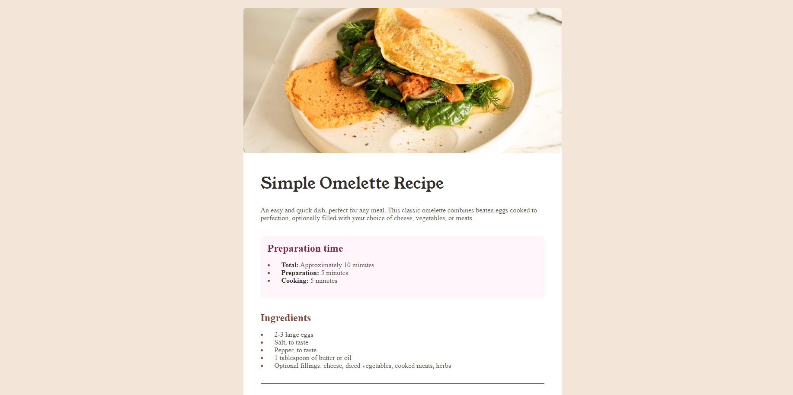

# Frontend Mentor - Recipe page solution

This is a solution to the [Recipe page challenge on Frontend Mentor](https://www.frontendmentor.io/challenges/recipe-page-KiTsR8QQKm). Frontend Mentor challenges help you improve your coding skills by building realistic projects.

## Table of contents

- [Overview](#overview)
  - [The challenge](#the-challenge)
  - [Screenshot](#screenshot)
  - [Links](#links)
- [My process](#my-process)
  - [Built with](#built-with)
  - [What I learned](#what-i-learned)
  - [Continued development](#continued-development)
  - [Useful resources](#useful-resources)
- [Author](#author)
- [Acknowledgments](#acknowledgments)

## Overview

### The challenge

A simply receipe card with play HTML and CSS

### Screenshot

### Links

- Solution URL: [Add solution URL here](https://github.com/lokopak/recipe-page-main)
- Live Site URL: [Add live site URL here](https://lokopak.github.io/recipe-page-main/)

## My process

### Built with

- Semantic HTML5 markup
- Plain CSS custom properties
- Flexbox
- Mobile-first workflow

## Author

- Frontend Mentor - [@lokopak](https://www.frontendmentor.io/profile/lokopak)
